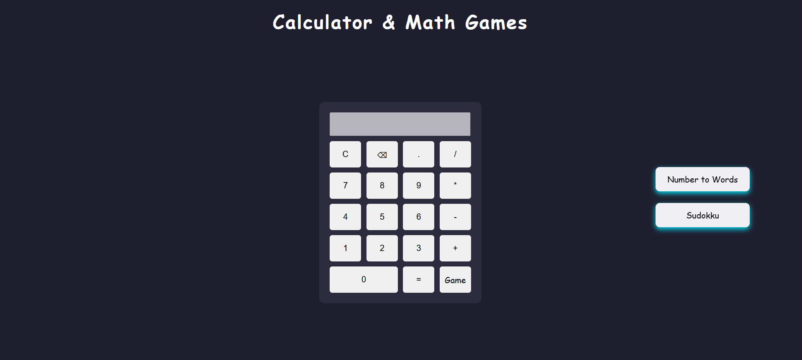
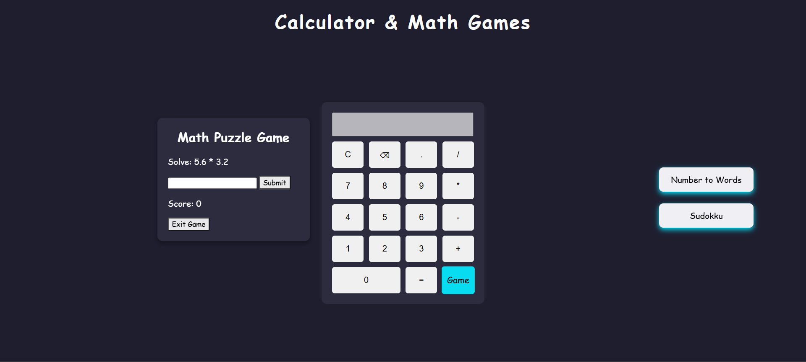
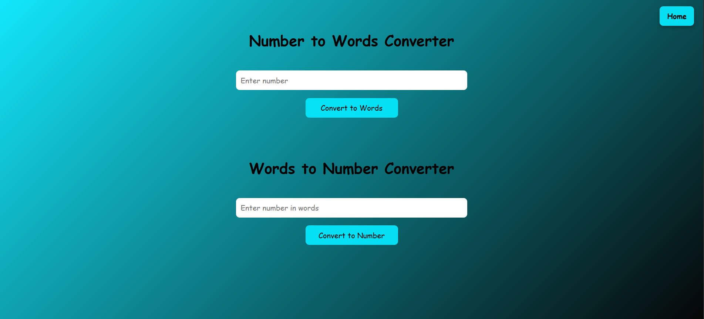
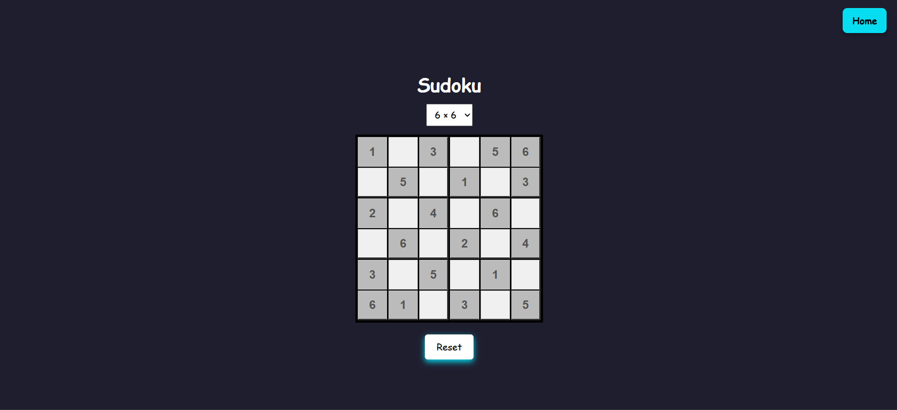

# Calculator & Games - An Interactive Calculator + Puzzle Website

An interactive, browser-based educational website that combines **mathematical utilities** and **logic-based games** to promote **learning through engagement**.  
This project focuses on improving **numerical ability, logical reasoning, and problem-solving skills** using a clean UI and real-time feedback.

---
## Live Website
You can access the deployed version of this project here:
**Website URL:**  
https://calculator-and-other-math-games-qan1obw5i.vercel.app/

---
## Project Motivation

Students and beginners often face challenges such as:
- Difficulty staying engaged while learning mathematics
- Lack of instant feedback during practice
- Limited access to interactive learning tools

This project addresses these problems by providing a **gamified, user-friendly platform** that encourages consistent practice and logical thinking — making it ideal for **learning, revision, and mental skill development**.

---

## Key Features:

### 1. Calculator
- Supports basic arithmetic operations:
  - Addition
  - Subtraction
  - Multiplication
  - Division
- Instant computation with a simple, responsive UI
- Useful for quick calculations and practice

---

### 2. Simple Math Game
- Interactive game for solving basic math problems
- Enhances:
  - Mental calculation speed
  - Accuracy
  - Focus
- Provides immediate validation to reinforce learning

---

### 3. Numbers ↔ Words Converter
- Converts:
  - Numbers ➝ Words
  - Words ➝ Numbers
- Helps users understand:
  - Place values
  - Number naming logic
- Useful for beginners and exam preparation

---

###  4. Sudoku Game
- Supports multiple grid sizes:
  - **4 × 4**
  - **6 × 6**
  - **9 × 9**
- Key highlights:
  - Real-time validation
  - Correct inputs highlighted in **blue**
  - Incorrect inputs highlighted in **red**
  - Pre-filled cells locked
  - Reset functionality
  - Confetti celebration on successful completion 🎉
- Improves:
  - Logical reasoning
  - Pattern recognition
  - Concentration

---

## Technologies Used

- **HTML5** – Page structure and layout
- **CSS3** – Styling, animations, responsive design
- **JavaScript (Vanilla)** – Game logic, validation, interactivity
- **Canvas API** – Confetti animation for game completion

---

## Screenshots

### Calculator

### Math Game

### Number ↔ Words Converter

### Sudoku Game

